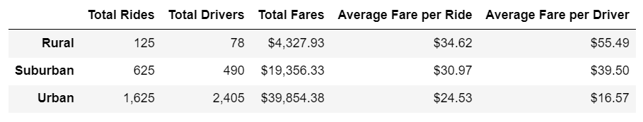
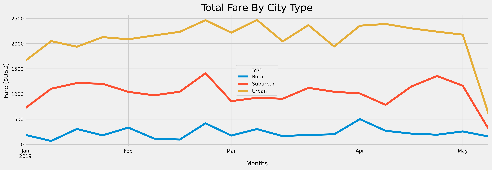

# PyBer_Analysis

## Overview of the analysis:
The CEO of PyBer requested an analysis of the data by city type (Urban, Suburban, and Rural). The scope of work includes using Python, Pandas, and Matplotlb to create a summary DataFrame and a multi-line graph of the total fares for each city type: Rural, Suburban, and Urban.

## Results:

### Summary DataFrame

The Urban city type had more total drivers than total rides, meaning not every driver completed at least one ride. This affects the average fare per ride and average fare per driver. 

The Urban city type had the lowest average fare per driver and earned significantly less than the Rural drivers although the Urban city type had the highest total fares.

The Rural city type had the least number of total drivers and the highest average fare per driver.

### Total Fare by City Type

All three city types start to peak at the end of February. For the Urban city type, more analysis is needed to determine the cause of the trend in March.
The Rural city type increases again at the end of March. The Suburban city type starts to peak again in April, while the Rural city type and Urban city type drop off.

## Summary:

The results of the summary DataFrame could be due to Urban cities being more compact and rides being shorter, which would account for a lower average fare per ride. Rural cities are more spread out which would account for a higher average fare per ride. To test this theory, PyBer should collect and analyze distance data to see the fare per mile.

PyBer can strategize to acquire more customers in Urban cities to increase the demand for rides. Another option would be to limit the number of new drivers in Urban cities in order to decrease the number of drivers without work during the year. 
